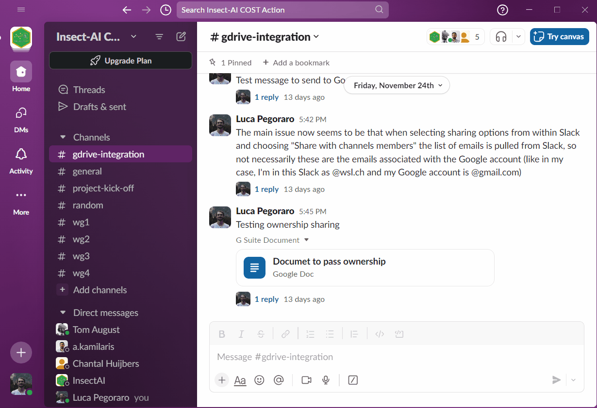
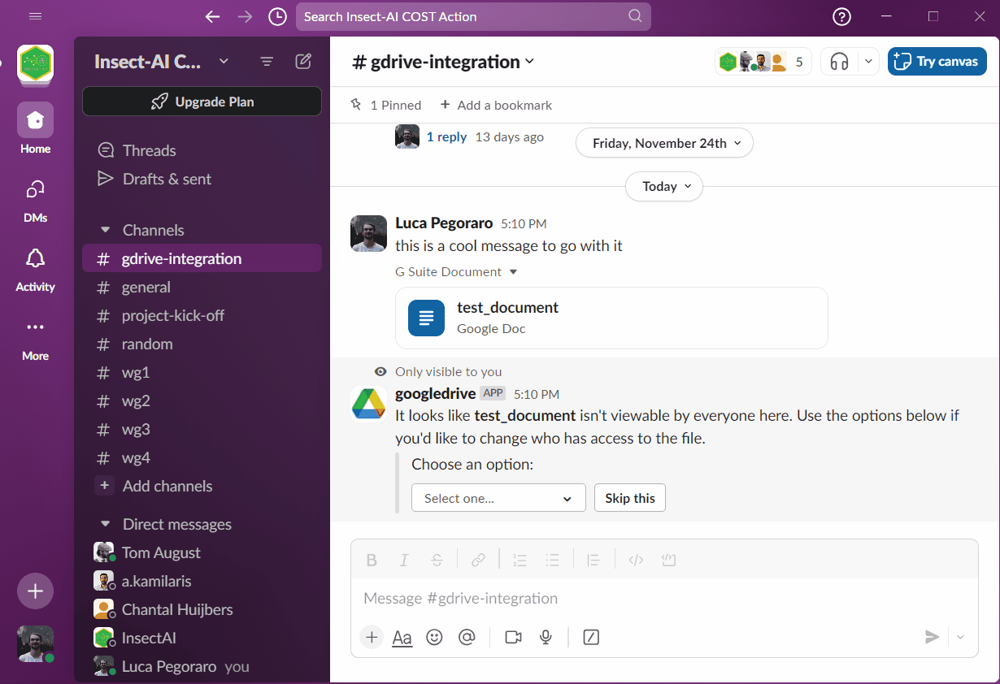
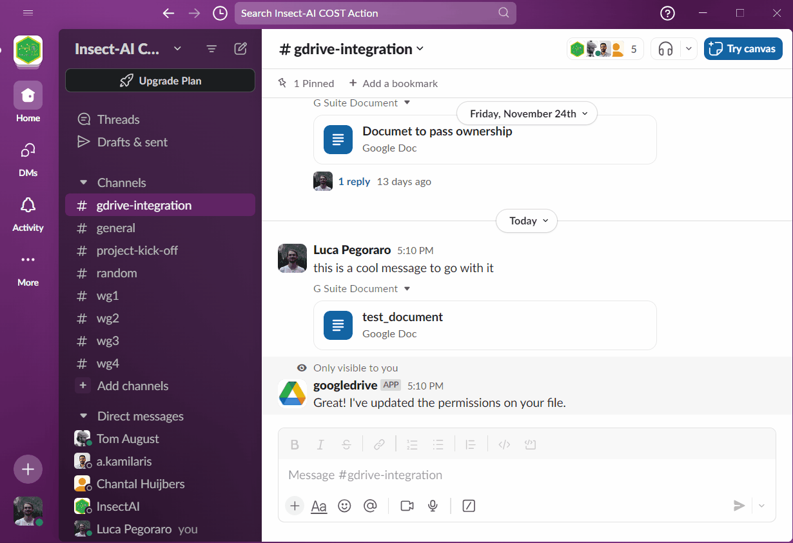

# InsectAI-slack
Instructions and guidelines for the COST action InsectAI's Slack channel. 

For comprehensive documentation on Slack take a look at the [Slack help pages](https://slack.com/help), this is just a quick guide on how to get going. 

## How to join the Slack workspace
> *link coming soon...*

Slack's sing-up is bit unusual, because it doesn't necessarily involve a classic username & password combination. 

If you have received an invitation email (check your spam folders too, it should come from an address `@slack.com`), click "Join workspace". 
If you don't have a Slack account, you'll be prompted to create one. 
You won't need to enter the password every time you log in to Slack, but you will need it if you want to log in to the workspace on another device (i.e. your phone or a different computer). 

Once you're logged in, you can either see the workspace via browser (e.g. Firefox, Chrome), or install the [Slack app](https://slack.com/downloads). 

## Guidelines for preserving information
Slack's free version does not show messages older than 90 days, or over 10'000 per channel (see [here](https://slack.com/pricing/free)). 
This means that useful conversations and resources can get lost if left in the channel too long. 

One way to circumvent this is to save important information in standalone online documents, like Google Docs or Google Sheets. 
This also has the advantage of making it easy to collaborate remotely. 

It's crucial that members recognize and take action when something is of enduring value, and transfer those contents to a separate document. 
A couple of clear indicators that you should probably move the discussion to a Google Doc are: 
 - people are posting links to resources, repositories, papers etc around a topic.
 - you are discussing about organisational stuff that will need to be looked at at a later date.
 - you are advising or receiveing advice on a task for the second, third or more time: probably this will be asked again, so put in a document and next time link that!
 - etc

### How to do it
If you want to start a new document, here are some steps for you to follow: 
 1. Create a Google Doc on your own account, preferrably with an informative title
 2. Set the sharing permissions to the desired level. 
 3. Copy the URL (i.e. the address in the top bar) of your Google Doc and paste it in the Slack channel.
 4. Either copy-paste important bits from Slack to the Google Doc yourself, or make sure that you coordinate with other members (if you've enabled other users to edit the document).  

Periodically, we will make sure to "backup" the most important docs linked in Slack using the Google Account we created for InsectAI (insectAI.cost *AT* gmail *DOT* com). 
It's also possible that we might request ownership of certain Google Docs for safekeeping and managing sharing permissions centrally. 

## [OPTIONAL] How to enable Google Drive integration in Slack
Slack has integrations for Google Drive that make it easier to manage sharing permissions and monitor comments directly in Slack. 

To install it please follow the [Guide](https://slack.com/help/articles/205875058-Google-Drive-for-Slack)

> ⚠️ WARNING: pay attention to what Google account is being linked used! If you have multiple accounts it's easy to choose the wrong one.

### Creating a new Google Doc from Slack

### Modifying sharing permissions 

### Transferring ownership

### Other useful Slack actions: 
 - [Managing your notifications](https://slack.com/help/articles/205875058-Google-Drive-for-Slack#manage-notifications)
 - ...
